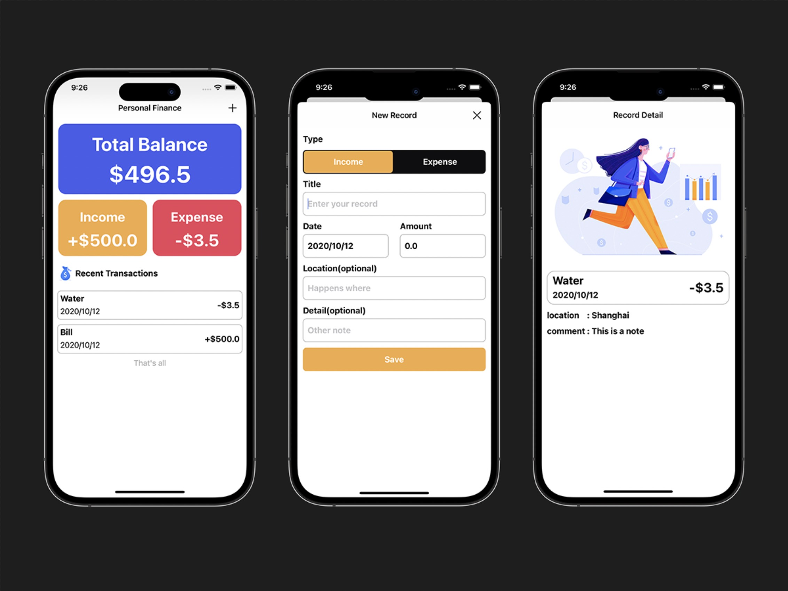

MoneyMate
=====

An open-source app which can help you record income and expense.

[中文](./README_ZH.md)

### 0x00 Introduction

First quick devolopment in iOS using Swift programmatically.

All UI and functions are using [MoneyPlus](https://github.com/SeekingMini/MoneyPlus) which is designed by Storyboard.

If you want to build iOS apps with out Storyboard, I believe this can help.

### 0x01 Function

- [x] Add a record 
- [x] Display the detail of a record

### 0x02 Feature

- [x] Using Core Data
- [x] Simple User Interface

### 0x03 Development Environment

- iOS >= 13.0
- Swift 5
- Xcode 15

### 0x04 TODO

- [ ] Dark mode support

### 0x05 Screenshot

