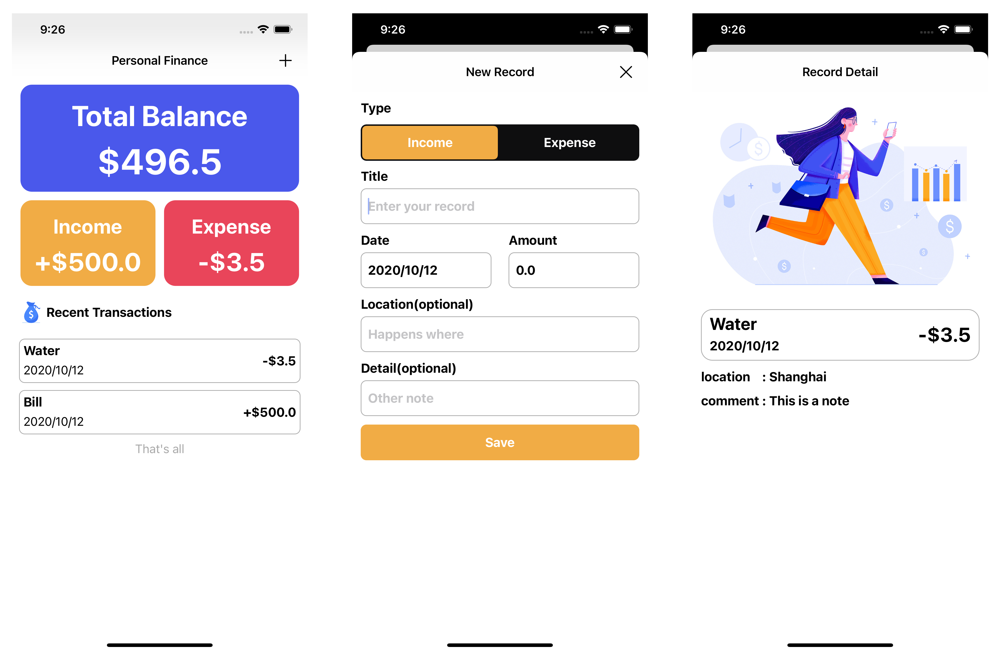

MoneyPlus
=====

一款开源的、帮助你记录收支的APP。

[English](./README.md)

### 0x00 简介

第一次使用Swift快速开发，一个晚上完成。

所有UI和功能借鉴于[MoneyPlus](https://github.com/SeekingMini/MoneyPlus)。

如果你想试试纯代码构建应用，那么这个基础应用可以带来一些启发。

### 0x01 功能

- [x] 添加收支记录
- [x] 展示收支记录细节

### 0x02 特色

- [x] 使用Core Data
- [x] 界面设计简约 

### 0x03 开发环境

- iOS >= 13.0
- Swift 5
- Xcode 12.0.1

### 0x04 TODO

- [ ] 编辑收支记录
- [ ] 添加收支记录统计表
- [ ] 支持Dark mode
- [ ] ...

### 0x05 屏幕截图

